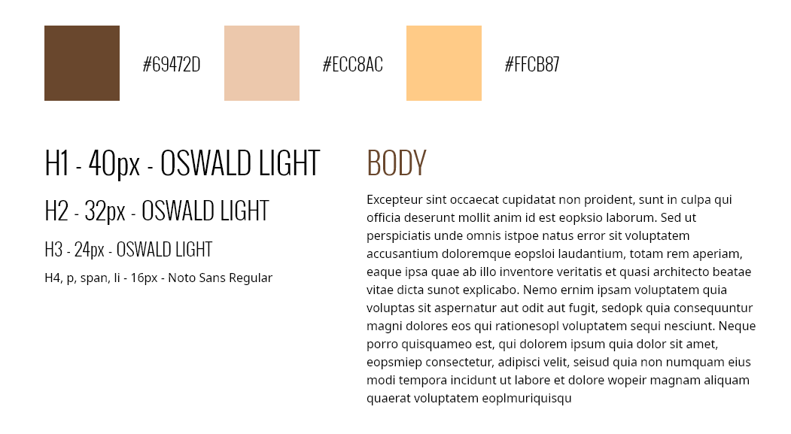
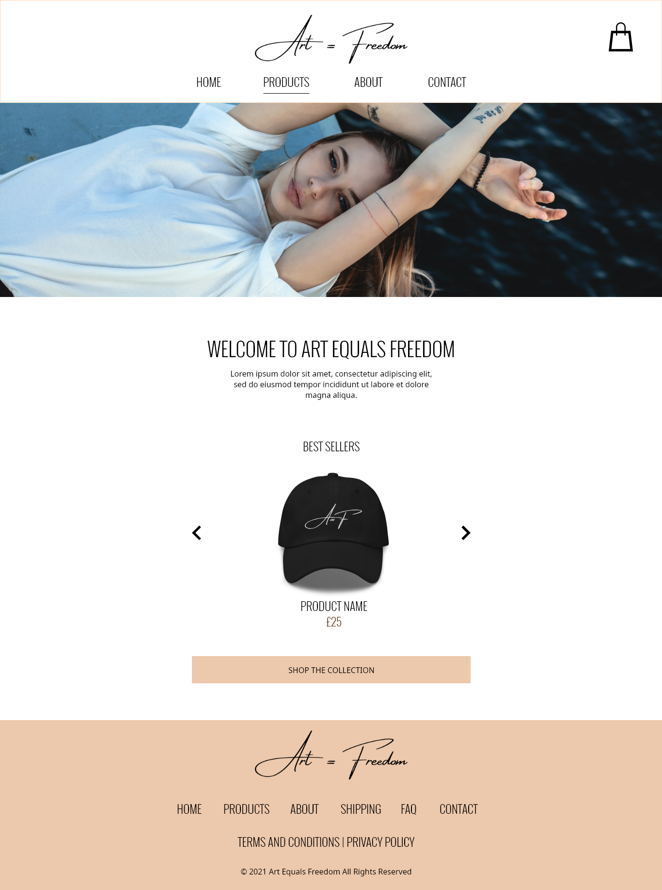

# Art Equals Freedom

### About the Project

Art Equals Freedom is a e-commerce store design selling tshirts and accessories.

#### Project Goals

01 - To design an ecommerce website using Adobe XD

### Site Map

### Colours & Typography

### Desktop

### Mobile

#### Written by Christine Lyston
#### Date: October 2021
